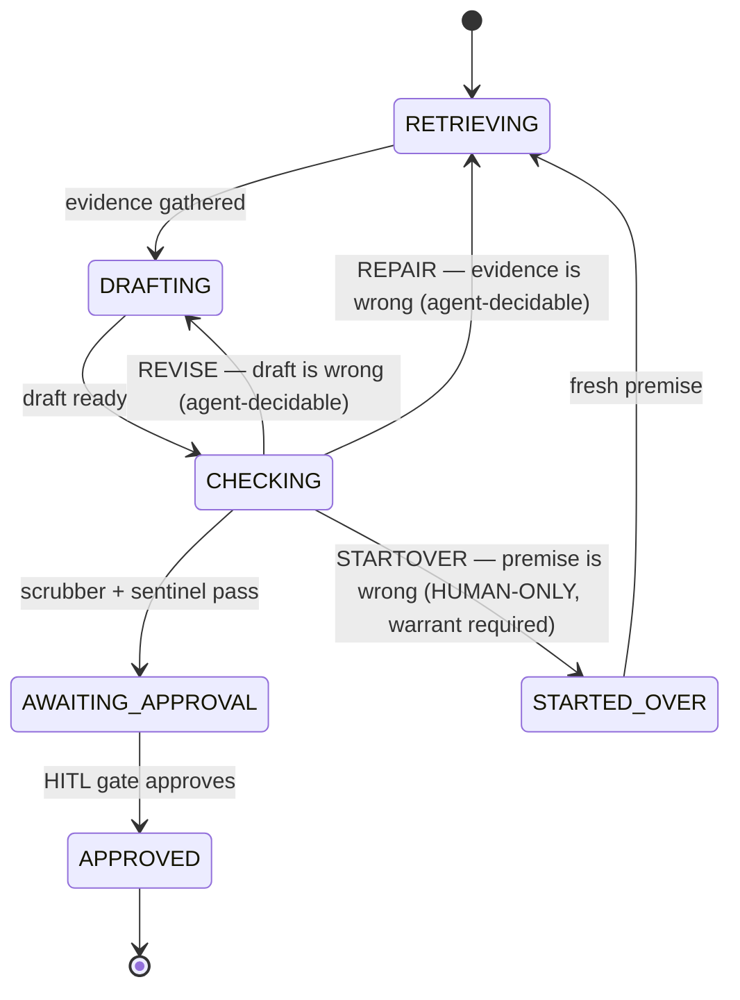
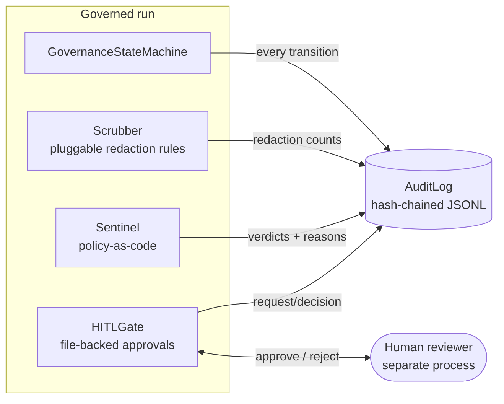

# Architecture

## The governed run

Every run moves through a fixed set of states. Failure outcomes are
only decidable at the check stage, and each names *what* was wrong —
which determines *where the run goes back to*.



Every transition — including *denied* startover attempts — is emitted
through an audit hook, so the audit trail records not only what the
system did but what it refused to do.

## Component layout



## The audit chain

Each record stores the SHA-256 hash of its own canonical JSON content,
and that content includes the previous record's hash:

```text
record[n].hash = sha256(canonical({index, timestamp, actor, action,
                                   payload, prev_hash=record[n-1].hash}))
record[0].prev_hash = "0" * 64   (genesis)
```

`verify()` walks the file and reports the **first broken link** with a
reason, distinguishing four failure classes in precedence order:

1. **Malformed record** — line is not a valid record
2. **Index gap** — a record was deleted or reordered
3. **Chain discontinuity** — `prev_hash` does not match the prior
   record's hash (catches an adversary who mutates a record *and*
   recomputes its own hash: the next link betrays them)
4. **Content tampering** — stored hash does not match recomputation

Opening an existing log for appending re-verifies the whole chain
first; a broken log raises rather than burying tampering under fresh
valid records.

### Trust model — what the chain does *not* protect against

A hash chain proves *internal consistency*, not external truth:

- **Tail truncation is invisible from the file alone.** Deleting the
  last k records leaves a valid shorter chain. Deployments that need
  truncation-evidence must anchor the tail hash externally (a separate
  system, a signed checkpoint, a peer log). `verify_file()` +
  `records_checked` gives you the anchor point.
- **A total rewrite is a valid different chain.** The chain stops an
  editor, not an author. File permissions (append-only at the OS
  level) and external anchoring close this.
- Timestamps are recorded, not proven.

These are inherent to hash chains, documented here rather than
hand-waved. The adversarial tests in `tests/test_audit.py` encode both
the caught cases and the documented-uncaught case.

## Failure semantics: why exactly three outcomes

Retry loops fail differently depending on *what* is wrong, and treating
all failures as "try again" burns tokens re-generating output from bad
evidence or a bad premise. The kit forces the diagnosis:

| Outcome | What is wrong | Where the run returns | Who may decide |
| ---- | ---- | ---- | ---- |
| `REVISE` | The draft | `DRAFTING` | Agent |
| `REPAIR` | The evidence | `RETRIEVING` | Agent |
| `STARTOVER` | The premise | `STARTED_OVER` → fresh `RETRIEVING` | **Human only** |

Startover is human-only because deciding "the premise is wrong" is a
scope decision, not a quality decision — precisely the class of calls
that must not be made autonomously. Enforcement is structural, not
advisory: the transition requires `initiated_by=HUMAN` **and** a
`HumanWarrant` (which cannot be constructed without a named approver
and reason). An agent holding a warrant is still refused.

## HITL gate: pause across processes

`HITLGate` persists each request as one JSON file
(`<store>/<id>.json`) with a one-way `PENDING → APPROVED | REJECTED`
lifecycle. Because the state is a file, the waiting process and the
deciding process need not be the same process, or even alive at the
same time — a run can block, die, and a resumed run can `wait()` on the
same id. Decisions record decider, timestamp, and note; deciding twice
raises.

## Dependency policy

The runtime is standard-library only. That is the framework-agnosticism
guarantee: nothing to conflict with whatever orchestrator (LangGraph,
CrewAI, bespoke) hosts the run. Framework adapters, if added, live in
optional extras and import *from* the kit, never the reverse.
